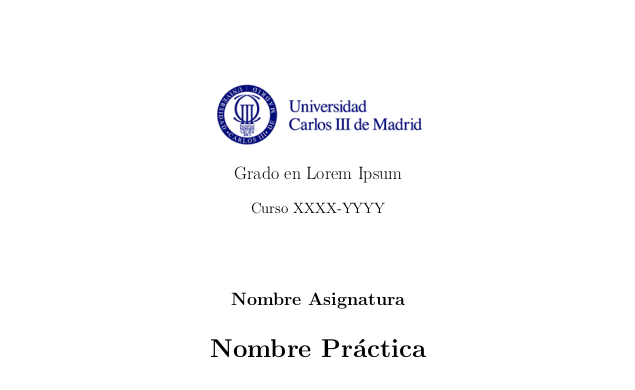
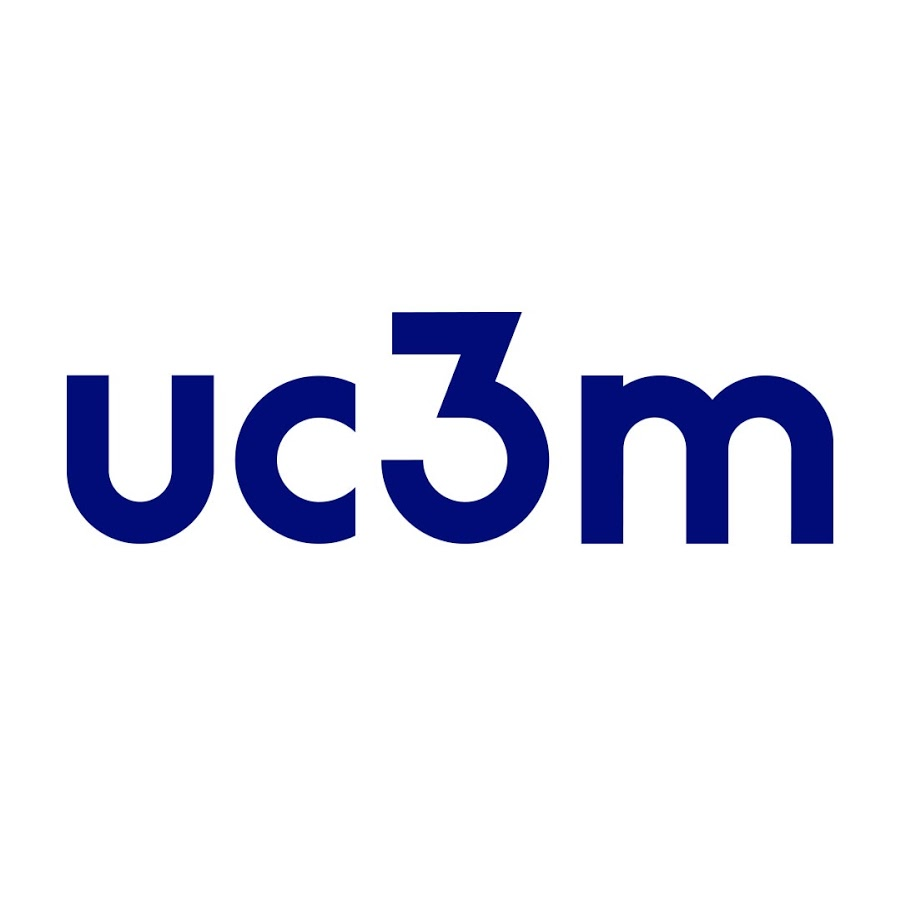
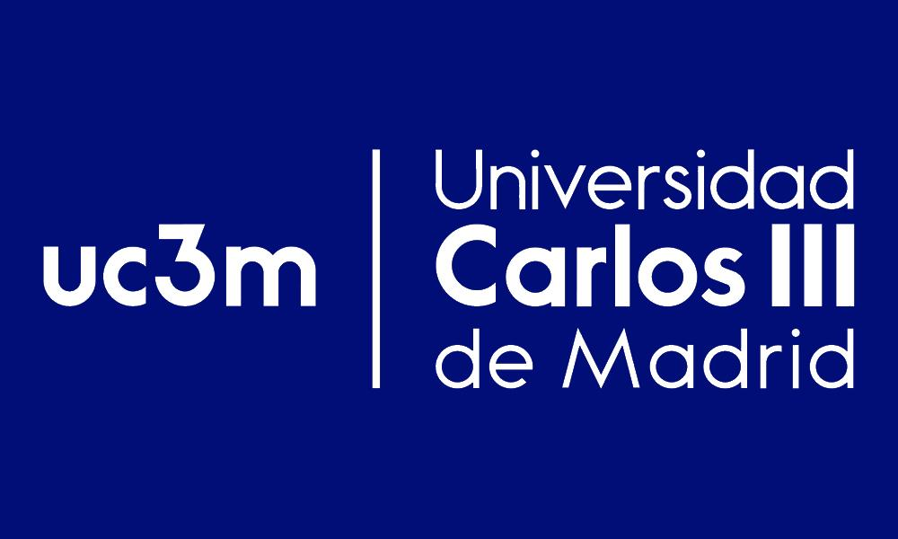

# Templates-Latex-UC3M
Templates de latex para prácticas de la Universidad Carlos III de Madrid

Si tienes alguna plantilla propia, o quieres contribuir a aumentando los ejemplos y plantillas ya existentes, eres bienvenido a realizar culauiqer *commit* que consideres.

## Compilación de la plantilla de prácticas

La plantilla para prácticas contiene un pdf del documento *practicasuc3m.tex*, pero, por supuesto, eres bienvenido a modificar el archivo y compilarlo tú mismo.

Para compilar *practicasuc3m.tex* es necesario la carpeta de *Images* y el archivo *uc3mpracticas.cls*. Este archivo contiene todas las bbliotecas y comandos especiales que utiliza la plantilla.

# Documentación

## uc3mpracticas.cls

La mayoría de los siguientes comandos, si no todos, están implementados en el archivo *practicasuc3m.tex*, así que no tengas miedo y cacharrea con ellos. Si tienes alguna duda o encuentras algún fallo, no dudes en rellenar un **Issue** al respecto.

Los comandos que se encuentran en este archivo son:

#### Comando para insertar la cabecera: **\headerpr**

Recibe un total de 4 argumentos:

  1. Tamaño de la línea de separación (*opcional*)
  2. Contenido de la cabecera izquierda
  3. Contenido de la cabecera central
  4. Contenido de la cabecera derecha

#### Comando para insertar el pie de página: **\footerpr**

Recibe un total de 4 argumentos:

  1. Tamaño de la línea de separación (*opcional*)
  2. Contenido del pie de página izquierda
  3. Contenido del pie de página central
  4. Contenido del pie de página derecha

### Comando para una portada genérica y centrada: **\centeredtitle**

Recibe un total de 5 argumentos:

  1. *Path* a la imagen
  2. Nombre de la carrera
  3. Curso actual
  4. Asignatura
  5. Título de la práctica

Su distribución es:

## practicasuc3m.tex

## Images

Dentro de esta carpeta hay una serie de imágenes de logos de la Universidad Carlos III, para que podais ponerlos en las portadas o cabeceras de vuetras prácticas.

Las imágenes que podeis encontrar en esta carpeta son:

 - **LogoUC3M.png**

- **SmallLogo.jpg**

- **MinLogo.jpg**

- **CircUC3M.png**

- **BlueLogo.jpg**

## Bibliotecas Usadas

 * Biblioteca para los encabezados y pie de página: **fancyhdr**
 * Biblioteca para el lenguaje en español: **babel** (con *spanish, es-noindentfirst, es-noshorthands, es-tabla*)
 * Bilioteca para cambiar márgenes de las páginas: **geometry**
 * Biblioteca para saber cual es la última página: **lastpage**
 * Biblioteca de caracteres aceptados: **inputenc** (con *utf8*)
 * Biblioteca para permitir el uso de diferentes headers y footers: **etoolbox**
 * Bibliotecas de imágenes: **graphicx**
 * Biblioteca para usar diferentes columnas: **multicol**
